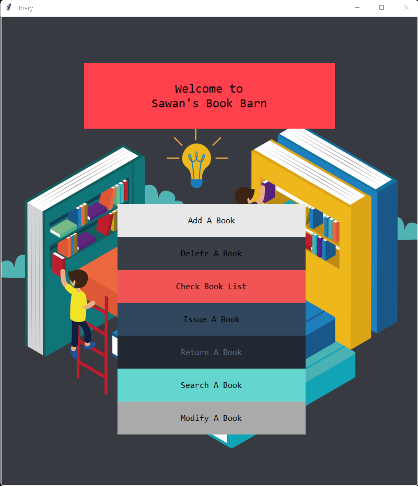
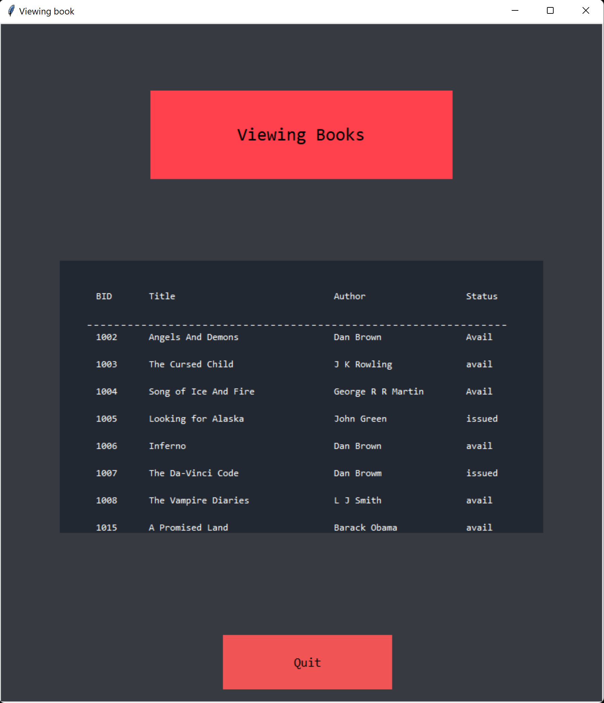
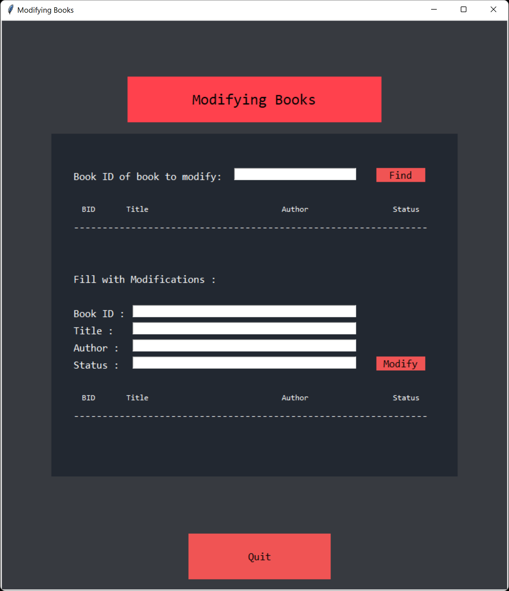
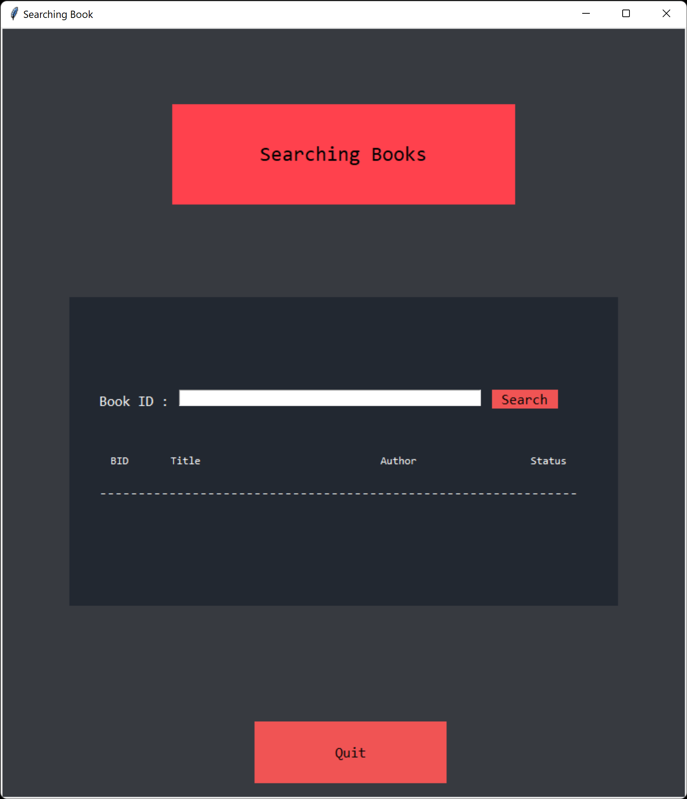
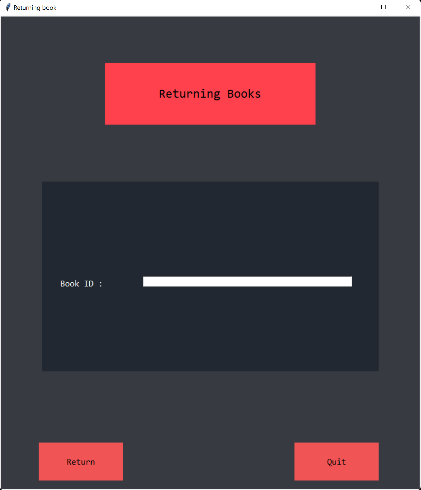

# Library-Management-System

> Completely in python , it can search, add, modify entries, delete entries etc. All done in python also uses SQL for database.

<!-- > Live demo [_here_](https://www.example.com). If you have the project hosted somewhere, include the link here. -->

## Table of Contents

- [General Info](#general-information)
- [Technologies Used](#technologies-used)
- [Features](#features)
- [Screenshots](#screenshots)
- [Setup](#setup)
- [Usage](#usage)
- [Project Status](#project-status)
- [Contributing](#contributing)
- [Contact](#contact)
- [License](#license)

## General Information

- It's my high school final computer science project.
- it intends to solve the hassel of managing library books.
<!-- You don't have to answer all the questions - just the ones relevant to your project. -->

## Technologies Used

- Python version 3.8
- Tkinter
- SQL and also pymysql library
- pillow for image stuff

## Features

Some awesome features are:

- [Awesome looking Homepage](#main-home-window)
- [Add a new book to the database](#add-a-new-book-indow)
- [Delete a book from the database](#delete-a-book-from-the-database-window)
- [Issue a book to a student](#issue-a-book-to-a-student-window)
- [Modify the book status/entries](#modify-book-deatils-window)
- [Return the book to the library](#return-book-back-to-library-window)
- [Search for a book and its status](#search-any-from-database_window)
- [View a book for availability](#view-book-deatils-window)

## Screenshots

### Main Home window



### View book deatils Window



### Add a new book Window


### Modify book deatils Window



### Search any from database Window



### Return book back to library Window



### Delete a book from the database Window


### Issue a book to a student Window


<!-- If you have screenshots you'd like to share, include them here. -->

## Setup

To run this project, install Python, SQL and pip install tkinter, pillow, pymysql

```bash
pip install tk
pip install pillow
pip install pymysql
```

## Usage

Clone or download the code and run with the above mentioned programs and libraries.

## Project Status

Project is : _no longer being worked on_. That being said, I would definitely welcome the improvements and features.

## Contributing

Pull requests are welcome. For major changes, please open an issue first to discuss what you would like to change.

## Contact

Created by [S44WN](https://github.com/S44WN) - feel free to contact me!

## License

[MIT License](https://github.com/S44WN/Library-Management-System/blob/main/LICENSE)
Copyright (c) 2022 Sawan
